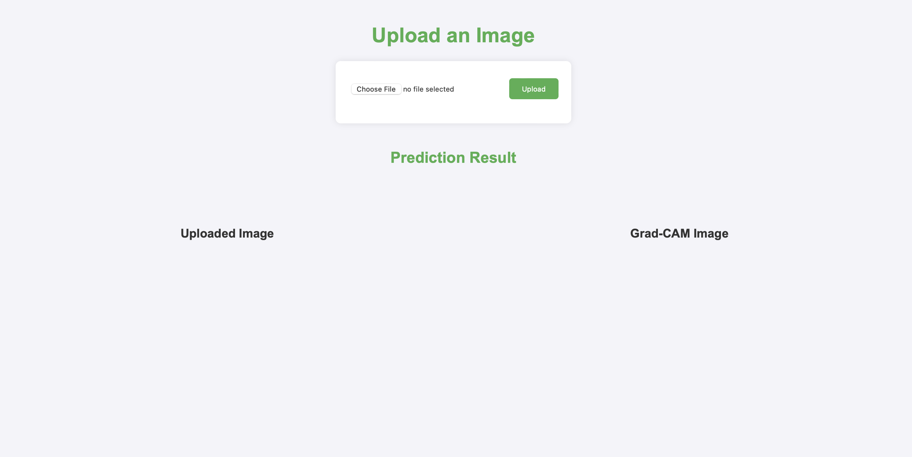
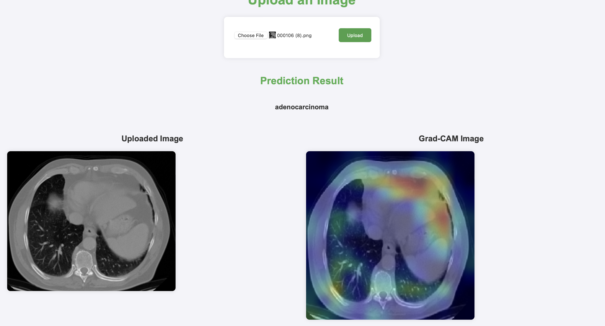

End to end machine learning project on cancer detection 
Uses:

1. Mlflow for experiment tracking
2. Dagshub as tracking uri
3. DVC for pipeline tracking 
4. Tensorflow for modeling and data(image) processing
5. !Github workflows for CI/CD(not complete)
6. Gradcam implementation for xAI

Gradcam simply shows gradients from the last convolutional layer to map the input image regions that contribute most to the final output class prediction






How to run:
1. Clone repo <br>
   ``` git clone https://github.com/wp225/CancerDetection.git```
2. Build docker image<br>
``` docker run -t <name> .``` <br>
   Will be hosted at port 8000
3. For the first instance run training by goin to 0.0.0.0/training. This runs <br>
    ```dvc repro```


## Workflows
1. config.yaml
2. secrets.yaml [optional]
3. params.yaml
4. entity
5. configuration.py in src
6. componenets
7. pipeline
8. main.py
9. dvc.yaml

github workflows not corrected